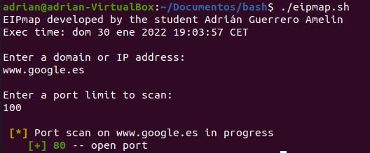

# NmapLitePoC
Proof of concept of a NMAP Lite for cibersecurity educational purposes only, <a href="https://eiposgrados.com/programas/master-en-ciberseguridad/">@eiposgrados</a>.

# Requirements
* Linux System (It uses /dev/tcp to scan).
* Bash interpreter.

# Options
When starting the script, you must introduce a valid IP/domain and a port limit to scan. It will generate a csv file with the results at the end of the scanning process.

